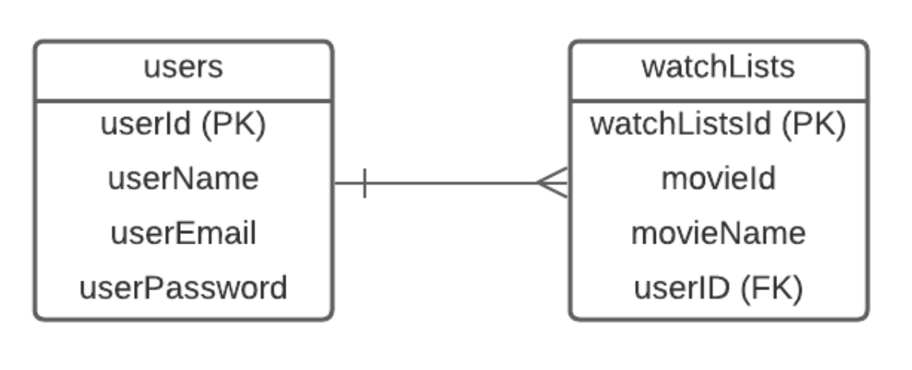

# Project name: Netflix-Clone

## Group members:
1. Terrence Butler
2. Dina Tanashikova
3. Anh Vy Le

## Project description:
**Netflix-Clone** is a movie application that allows users to discover new movies. Our MVP is to create a web application that users can search movies by keywords to get movie’s information such as poster, rating, trailer, and synopsis. Users can also register to the app to access more features. When users login to the app, they are able to add movies to their watchlists if they decide to watch these movies later.

## Wireframes:
Our group uses Adobe XD to build our wireframes for this project. 
https://xd.adobe.com/view/7d108d22-579c-43cb-90e7-a757920979f3-2843/

**Homepage**

**Home/search-result page**

**Watch movie page**

**Signup/login page**

**Delete account page**

**User’s watch lists page**

## User stories:
- As a user, I’m able to register to the web application
- As a user, I’m able to delete my account from the web application
- As a user, I’m able to log in to the web application
- As a user, I’m able to log out of the web application
- As a user, I’m able to search “keyword” to find movie on search bar
- As a user, I’m able to add  a movie to my watchlists
- As a user, I’m able to delete a movie from my watchlists

## Database models:

**A list of all the entities, its attributes and data types**
- Users: userId (PK, integer), userNname (varchar 255), userEmail (varchar 255), userPassword (varchar 255)
- Watchlists: watchListId (PK, integer), userId (FK, integer), movieName (varchar255)

**Business rules:**
- A user can add many movies to his/her watch later list
- The watchlists can only be accessed by the user who creates it

**Entity relationship diagram:**

## Bonus features:
- Users can modify their account such as change username, email or password.
- Users can rate the movies
- Users can see the top 10 popular movies
- Users can see the top rated movies
