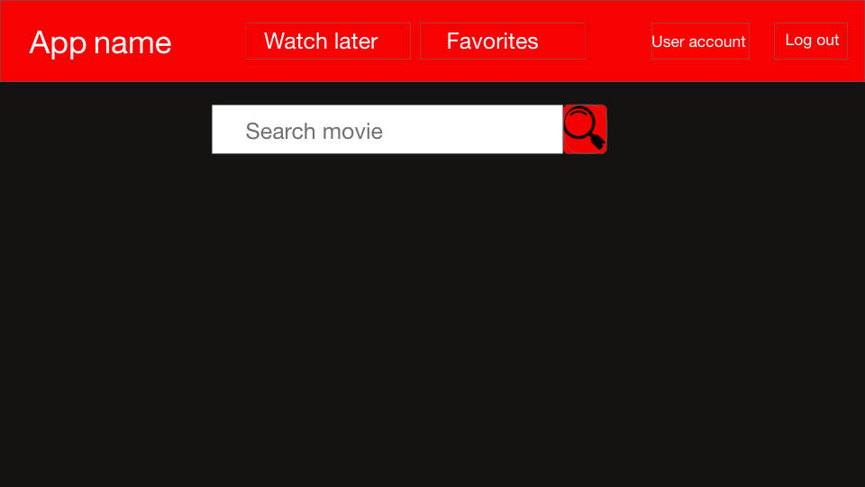
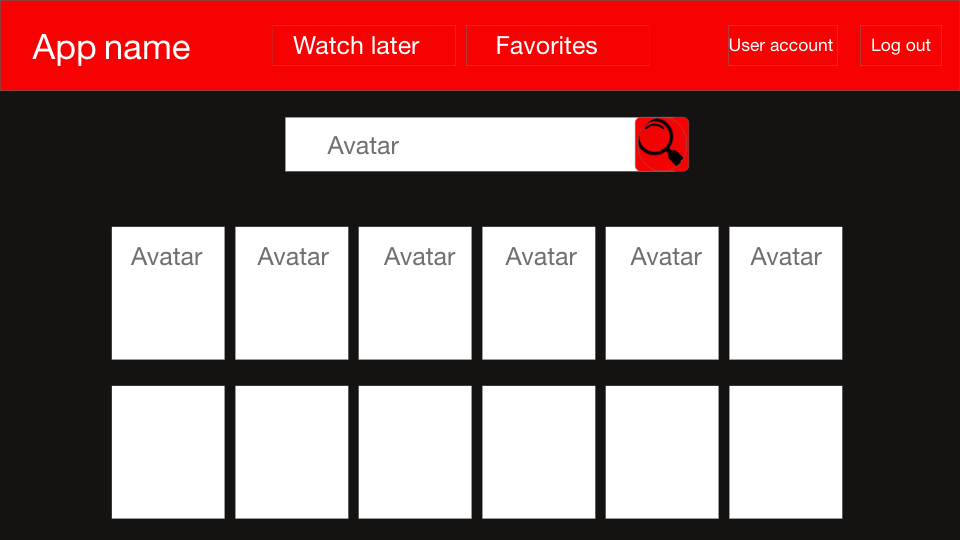
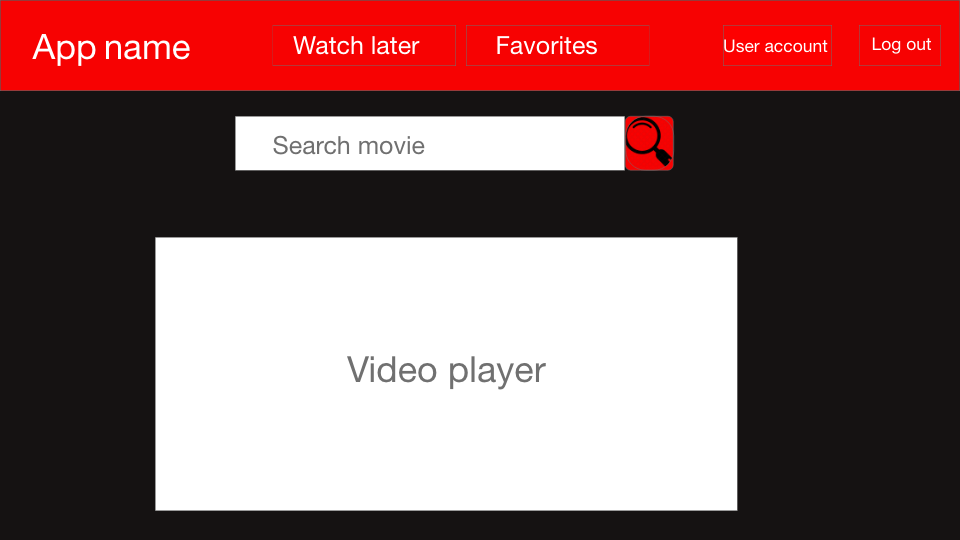
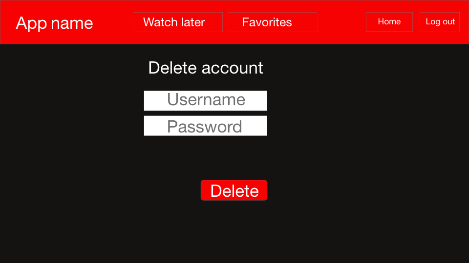
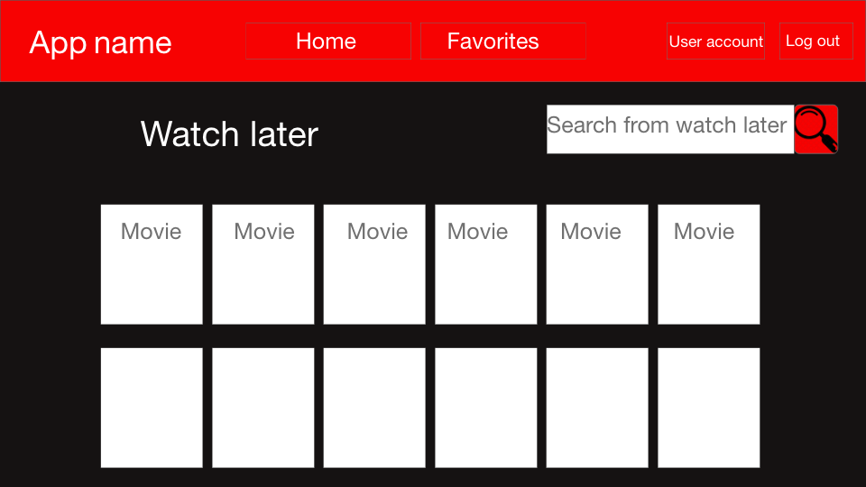
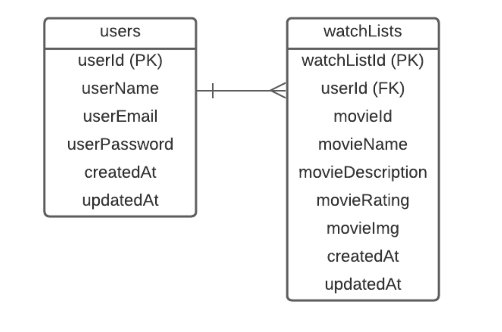

# Project name: Netflix-Clone
 
## Group members:
1. Terrence Butler
2. Dina Tanashikova
3. Anh Vy Le
 
## Project description:
**Netflix-Clone** is a movie application that allows users to discover new movies. Our MVP goal is to create a web application that users after login will be able to browse movie’s information such as poster, trailer, rating and synopsis. Furthermore, users can not only watch the movie that they choose but also can add movies to their watch later list if they decide to watch these movies later.
 
## Wireframes:
Our group uses Adobe XD to build our wireframes for this project.
 
https://xd.adobe.com/view/7d108d22-579c-43cb-90e7-a757920979f3-2843/
 
**Homepage**
 

 
**Home/search-result page**
 

 
**Watch movie page**
 

 
**Signup/login page**
 

 
**Delete account page**
 

 
**User’s watch lists page**
 

 
## User stories:
- As a user, I’m able to register to the web application.
- As a user, I’m able to log in to the web application.
- As a user, I’m able to log out of the web application.
- As a user, I’m able to delete my account from the web application.
- As a user, I’m able to browse movie’s information such as poster, trailer, rating and synopsis on dashboard.
- As a user, I'm able to watch movie bt clicking on Watch Now button.
- As a user, I'm able to add movie to my watchlist by clicking to Watch Later button.
- As a user, I’m able to search “keyword” on search bar to find movie.
- As a user, I’m able to add a movie to my watchlists.
- As a user, I’m able to delete a movie from my watchlists.
 
## Database models:
 
**A list of all the entities, its attributes and data types**
- Users: userId (PK, integer), userName (string), userEmail (string), userPassword (string), createdAt (date), updateAt (date)
- Watchlists: watchListId (PK, integer), userId (FK, integer), movieId (integer), movieName (string), movieDescription (text), movieRating (string), movieImg (string), createdAt (date), updateAt (date)
 
**Business rules:**
- A user can add many movies to his/her watch later list
- The watchlists can only be accessed by the user who creates it
 
**Entity relationship diagram:**
 

 
## Bonus features:
- Users are able to update their username, email or password.
- Users are able to delete their account.
- Users are able to delete movies on their watchlist.
- Users are able browse movies based on categories such as the top trending, Netflix original, top rated, family movies, animated movies, romance movies, comedy movies, action movies on Dashboard.
 

